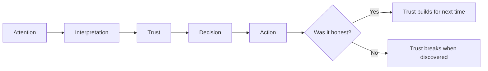

# Chapter 1 — Persuasion and Human Decision-Making

## What Persuasion Actually Is.

Persuasion is the practice of shaping what someone pays attention to, how they interpret it, how much they trust it, and what they end up doing about it. That's it. It's not a trick, and it's not inherently dishonest — it's just the mechanics of communication with intent behind it.

Every time you write a headline instead of a wall of text, choose a color for a "Buy Now" button, or decide which feature to mention first in a pitch, you're persuading. You're making a claim about what matters and asking someone to see it your way. Design, marketing, writing, and even body language are persuasion tools whether or not anyone calls them that.

The important part is *why* you're doing it and *how honestly* you're doing it. Which brings us to the distinction that matters most in this chapter.

## Persuasion vs. Coercion vs. Manipulation

These three get lumped together constantly, but they work differently:

- **Persuasion** gives someone true, relevant information and lets them decide. The person could reasonably say no and walk away no worse off for having considered it.
- **Manipulation** exploits a psychological shortcut, a blind spot, or an emotional vulnerability to steer a decision the person wouldn't make with full, clear information. It often *works*, but it works by bypassing judgment rather than engaging it.
- **Coercion** removes the choice entirely — through force, threats, or engineered situations where saying no is not a real option.

Here's a simple test: if you told the other person exactly what technique you were using and why, would the persuasion still work? "I'm showing you this data because I think it supports my case, and you're free to check it" survives that test. "I'm creating a fake countdown timer so you feel rushed" does not. That gap is where manipulation lives.

This distinction matters for you specifically because you're learning to design things — interfaces, products, pitches. You will constantly face a choice between the version that respects the user's judgment and the version that exploits it. Both can move numbers. Only one is a practice you can be proud of five years from now.

## Robert Cialdini's Principles of Influence

Psychologist Robert Cialdini spent years studying what reliably moves people toward "yes." He organized his findings into a set of principles that show up everywhere from sales scripts to app design. Understanding them does two things at once: it makes you more effective, and it makes you harder to manipulate, because you start recognizing the pattern the moment you see it.

1. **Reciprocity** — People feel obligated to return a favor. A free sample, a helpful piece of content, or a generous first offer creates a pull toward giving something back.
2. **Commitment and Consistency** — Once someone takes a small step or states a position, they tend to act in ways that stay consistent with it. This is why "just try it for a week" works better than "buy it forever."
3. **Social Proof** — People look to others, especially people like themselves, to decide what's correct or acceptable. Reviews, testimonials, and "10,000 people bought this" messaging lean on this.
4. **Authority** — Credentials, expertise, and confident, credible framing make people more likely to trust a recommendation without independently verifying it.
5. **Liking** — We say yes more often to people and brands we like — because they're similar to us, they compliment us, or we simply find them likable or attractive.
6. **Scarcity** — Things that seem limited, rare, or about to disappear feel more valuable. "Only 3 left" or "sale ends tonight" taps this directly.

These aren't manipulation tactics by default. Each one becomes manipulative only when it's faked — fake scarcity, fake authority, fake social proof. Used honestly, they're just accurate descriptions of how humans weigh information.

## Beyond Cialdini: Two More Useful Ideas

Cialdini's six principles are the most famous framework, but they're not the whole picture. Two more concepts are especially useful for anyone doing design or communication work.

**Framing Effects (Behavioral Economics).** The same fact, presented differently, produces different decisions. "90% fat-free" and "10% fat" describe the identical product, but people respond to them differently. Framing isn't about changing information — it's about choosing which true description you lead with, and that choice shapes perception more than most people expect.

**Ethos, Pathos, Logos (Classical Rhetoric).** Aristotle identified three appeals a communicator can make: *ethos* (credibility of the speaker), *pathos* (emotional connection), and *logos* (logical argument and evidence). Effective persuasion, in a pitch, an ad, or an essay, usually blends all three rather than relying on just one. A purely logical argument with no credibility or emotional resonance often falls flat, even when the logic is airtight.

## Principle → Mechanism → Ethical Use → Misuse Risk

| Principle | Mechanism | Ethical Use | Misuse Risk |
|---|---|---|---|
| Reciprocity | Obligation triggered by receiving something first | Offer genuinely useful free value (a guide, a sample, real help) | Manufacturing a false sense of debt or guilt |
| Commitment & Consistency | Small agreements make people want to stay consistent | Let people opt in gradually to something they actually want | Trapping people into an escalating series of asks they didn't intend to make |
| Social Proof | People copy the judgment of others, especially peers | Show real reviews, real usage numbers | Fabricated testimonials, fake "X people are viewing this" counters |
| Authority | Confidence and credentials shortcut careful evaluation | Cite real expertise and qualifications | Borrowed or invented authority (fake experts, misleading titles) |
| Liking | Positive feeling toward the source increases agreement | Be genuinely likable, warm, and relatable | Manufactured flattery or fake rapport used to lower someone's guard |
| Scarcity | Perceived limits raise perceived value | Communicate real, honest limits (real low stock, real deadlines) | Fake countdown timers, fake "almost sold out" labels |
| Framing | Same facts, different presentation, different perception | Lead with the framing that's clearest and most relevant | Selectively framing to hide an unfavorable fact |
| Ethos/Pathos/Logos | Credibility, emotion, and logic combine to move belief | Balance all three honestly to make a real case | Overloading emotion to drown out weak logic |

## A Simple Decision Journey

Persuasion rarely happens in one instant — it moves a person through stages. Here's a simplified version of that journey:

Notice the branch at the end. Even a persuasion attempt that "works" in the short term has a second outcome: it either builds trust for the next interaction or quietly destroys it. Manipulative tactics tend to win the moment and lose the relationship.

## Questions to Ask Before Trying to Persuade

Before you use any persuasion technique in your own work, ask yourself:

- Is every claim I'm making actually true?
- Would this still work if I explained my technique out loud to the person?
- Am I helping someone make a better decision, or am I bypassing their judgment?
- Could the person walk away from this with no real loss, if they chose to?
- Am I respecting their time, attention, and intelligence?
- If this technique became public knowledge, would I still feel fine using it?

If you hesitate on any of these, that's worth paying attention to.

## The White T-Shirt Example

Take a completely plain white T-shirt — no logo, no story, nothing special about the fabric. The shirt itself never changes. But how it's presented can shift how it's perceived, without a single stitch being altered:

- **Framed as a basic** — "Plain white tee, $8." Sold as a commodity: functional, cheap, replaceable.
- **Framed with authority** — "Designed with input from a materials engineer for durability." Same shirt, suddenly feels considered.
- **Framed with social proof** — "The tee 50,000 people already own." Suddenly it feels like a safe, popular choice.
- **Framed with scarcity** — "Limited run, restocking in 3 months." Suddenly it feels worth grabbing now.
- **Framed with liking** — Sold by a creator the buyer already follows and enjoys, wearing it in a way that feels personal and relatable.

None of these framings lie about the shirt's basic nature — it's still a plain white T-shirt. But each framing changes what the buyer notices first, what they compare it to, and how much they're willing to pay. That's persuasion operating entirely through framing and context, with zero changes to the product itself. It becomes manipulation only if one of those claims is false — a fake "50,000 people" number, an invented engineer, a restock date that isn't real.

## Explore Further

If you want to go deeper on any of this, these are good starting points to search for yourself (rather than links, since exact sources should always be verified firsthand):

- Robert Cialdini's book *Influence: The Psychology of Persuasion* — the original source for the six principles above
- Search for "prospect theory framing effects" to go deeper into behavioral economics
- Search for "Aristotle rhetoric ethos pathos logos" for the classical rhetoric background
- Look into "dark patterns UX design" to see manipulation principles applied specifically to interfaces
- Search for "FTC guidelines on deceptive advertising" to see where persuasion legally crosses into manipulation

## What You Should Remember

- Persuasion shapes attention, interpretation, trust, and action — it is not inherently dishonest.
- The line between persuasion and manipulation is whether the technique still works when explained honestly.
- Cialdini's six principles — reciprocity, commitment/consistency, social proof, authority, liking, and scarcity — describe real patterns in human decision-making, and each has an honest use and a manipulative misuse.
- Framing and the ethos/pathos/logos model add two more useful lenses beyond Cialdini's list.
- The same product, like a plain white T-shirt, can be perceived very differently through framing alone, without changing the product.
- Before persuading anyone, ask whether you're helping them decide well or steering them around their own judgment.
