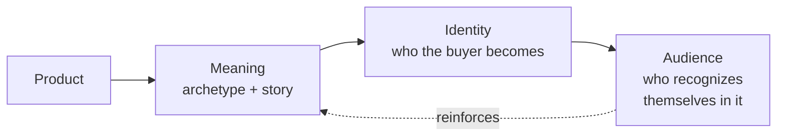

# Chapter 2 — Brand Archetypes and Meaning

## Archetypes as a Branding Framework

An archetype is a recognizable, recurring pattern of meaning that shows up across stories, cultures, and time — the Hero, the Rebel, the Caregiver. These patterns feel familiar to almost anyone because they echo through myths, movies, and everyday storytelling long before any brand borrows them.

In branding, archetypes are a shortcut. A product is just an object until a brand attaches a story to it — and archetypes give designers and marketers a proven vocabulary for that story. Instead of describing a brand as "modern and trustworthy" (vague, forgettable), you can describe it as *the Sage* — a brand built around wisdom, expertise, and helping people understand something true. That single word carries a whole bundle of associations: tone of voice, visual style, the kind of promises the brand makes.

The real value of an archetype isn't decoration. It answers a practical question for every brand decision you make:

**"What does the audience get to feel, imagine, or become by choosing this brand?"**

A brand isn't just selling a product's function — it's selling a role the customer gets to step into. Archetypes make that role legible and consistent.

## Archetypes Are Models, Not Personality Diagnoses

Here's the caution that matters most in this chapter: archetypes are simplified cultural patterns, not literal descriptions of a brand's or a person's fixed personality. Treating them as diagnostic labels — "this brand *is* a Hero, full stop" — misses the point and produces flat, one-note branding.

A few things to keep in mind:

- **Brands blend archetypes.** Most strong brands lean on a primary archetype but borrow traits from a secondary one. A brand can be mostly Explorer with a touch of Rebel.
- **People contain multitudes.** The same customer might respond to Hero energy in a running shoe ad and Caregiver energy in a family insurance ad. Archetypes describe a mode being activated in a moment, not a permanent trait of the person.
- **Culture changes the reading.** An archetype that reads as "Rebel" in one cultural context might read as "Everyperson" or even off-putting in another. Symbols and story patterns are filtered through the audience's own cultural references.
- **Archetypes are tools for clarity, not cages.** Their job is to help a team make consistent decisions, not to lock a brand into a single rigid personality forever.

Think of an archetype the way you'd think of a compass heading, not a fixed destination. It orients decisions; it doesn't dictate every one of them.

## A Useful Set of Common Brand Archetypes

| Archetype | Core Desire | Feels Like |
|---|---|---|
| Explorer | Freedom to discover new territory | Adventure, independence, escape from routine |
| Sage | Understanding and truth | Wisdom, expertise, clarity |
| Creator | Making something original | Imagination, craftsmanship, self-expression |
| Ruler | Control and order | Authority, prestige, structure |
| Caregiver | Protecting and helping others | Warmth, generosity, safety |
| Rebel | Breaking rules that no longer serve | Disruption, defiance, liberation |
| Hero | Proving competence through action | Courage, achievement, mastery |
| Everyperson | Belonging and being down-to-earth | Familiarity, humility, connection |
| Innocent | Simplicity and optimism | Purity, honesty, ease |
| Jester | Living in the moment | Humor, playfulness, lightness |
| Lover | Intimacy and connection | Passion, beauty, closeness |
| Magician | Transformation | Vision, wonder, making the impossible feel possible |

These twelve are the commonly cited set, but they're a starting vocabulary, not a rulebook — a brand strategist can blend, adapt, or add to them as long as the underlying story stays coherent.

## Same Product, Different Meaning: The T-Shirt Again

The plain white T-shirt returns as our example, because the point of archetypes is exactly this: identical products can carry completely different meaning depending on the story wrapped around them.

**Version 1 — The Explorer T-Shirt**
Marketed as gear: "Built for the trail, the flight, the next place you haven't been yet." Photographed on a hiker mid-climb. The shirt is framed as a blank, durable base layer for people chasing new experiences. The feeling on offer: freedom and readiness for whatever's next.

**Version 2 — The Ruler T-Shirt**
Marketed as a premium essential: "The only white tee your wardrobe needs — precision-cut, engineered fit, made to outlast trends." Sold at a higher price point, photographed in a minimalist studio with clean lines. The feeling on offer: control, taste, and quiet authority.

**Version 3 — The Innocent T-Shirt**
Marketed around simplicity and honesty: "No logos. No noise. Just a good, honest shirt." Positioned against overbranded fashion, appealing to people tired of status signaling. The feeling on offer: relief, purity, and ease.

**Version 4 — The Rebel T-Shirt**
Marketed as a statement against fast fashion: "We refuse to print a logo on your chest so a company can advertise on your body for free." Positioned as pushing back against consumer culture itself. The feeling on offer: defiance and independence from the norm.

Same stitching, same fabric, same cut — four entirely different reasons to buy it, and four entirely different customers who'd reach for each one.

## Product → Meaning → Identity → Audience

The arrow looping back matters: once an audience adopts a brand's meaning, their own behavior (how they talk about it, wear it, share it) reinforces and sharpens that meaning further. Archetype and audience shape each other over time.

## Archetypes Are Not Destiny

An archetype is a starting lens, not a life sentence for a brand. A company can evolve its primary archetype as its audience, culture, or product line shifts — plenty of brands have moved from one dominant archetype toward another over the years as their positioning matured. Locking a brand permanently into one archetype, applied rigidly and literally in every touchpoint, tends to produce branding that feels mechanical rather than authentic.

The archetype should describe the emotional territory a brand consistently returns to — not a costume it wears identically in every situation. A Caregiver brand can still have a Hero moment. A Rebel brand can still be gentle in a customer-service email. The archetype is the center of gravity, not an iron cage.

## Questions to Ask When Choosing an Archetype

- What does our audience actually want to feel, imagine, or become — not what do we want to say about ourselves?
- Which archetype's core desire genuinely matches what our product delivers, rather than just sounding appealing?
- Are we choosing this archetype because it's true to the product, or because it's currently trendy?
- Could this archetype be misread or land differently across the cultural contexts our audience lives in?
- Does this archetype leave room to grow, or does it lock us into a single note?
- If a customer described how our brand makes them feel, would that description actually match the archetype we picked?

## What You Should Remember

- Archetypes are recurring cultural and narrative patterns that give brands recognizable, legible meaning.
- They are models for orienting decisions, not literal personality diagnoses of a brand or its customers — people and brands blend traits, and culture shapes how an archetype reads.
- A shared set of archetypes — Explorer, Sage, Creator, Ruler, Caregiver, Rebel, Hero, Everyperson, Innocent, Jester, Lover, Magician — offers a practical starting vocabulary.
- The identical product can be positioned through very different archetypes, as shown with four versions of the same plain white T-shirt.
- Meaning flows from product to identity to audience, and audience behavior reinforces that meaning over time.
- An archetype is a center of gravity for a brand, not a rigid cage — it can flex and evolve without losing coherence.
