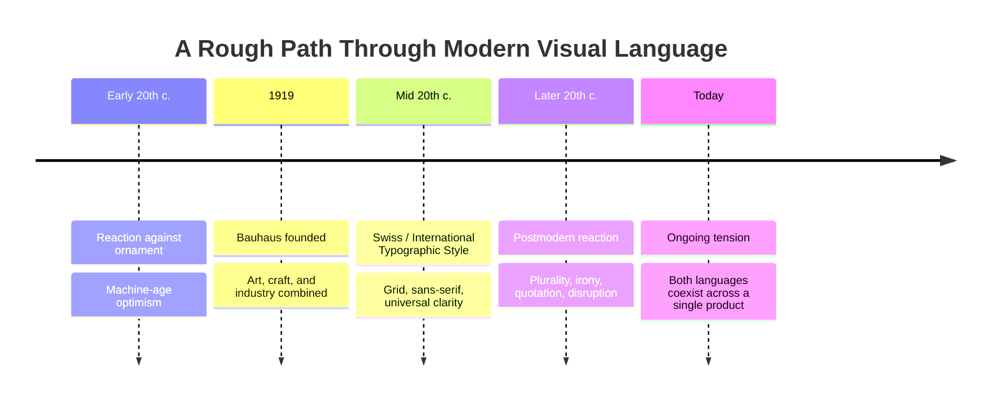

# Chapter 3 — Modernism, Postmodernism, and Visual Language

## Design Is Never Neutral

Every layout makes an argument, whether its designer intended one or not. A tight grid with generous white space argues for order and trustworthiness. A collage of clashing fonts argues for energy and rebellion. Long before you read a single word on a page, the visual language has already told you something about what kind of thing you're looking at.

This chapter traces where a huge amount of today's visual vocabulary comes from: a decades-long argument between two design worldviews — modernism and postmodernism — that never actually resolved. It just kept echoing forward, and you can still see both sides of it on the app you opened this morning.

## The Path Into Modernism

In the early twentieth century, rapid industrialization, new materials, and new technologies (steel, glass, mass printing, mass production) pushed designers to ask a new question: what should design look like in an age of machines and mass society? The answer many of them converged on was a rejection of decorative, ornament-heavy styles in favor of something leaner — forms justified by function and material, not by tradition or embellishment.

This was modernism's founding instinct: strip away what isn't necessary, and let what remains speak clearly. It was optimistic about progress, technology, and the idea that good design could be rational, universal, and even socially useful — a tool for a better-organized world.

### Bauhaus

The Bauhaus school, founded in Germany in 1919, became one of modernism's most influential engines. It combined fine art, craft, and industrial production under one roof, teaching students to think about form, material, and function together rather than treating "art" and "design" as separate worlds. Bauhaus thinking pushed toward geometric clarity, honest use of materials, and design that could be produced at scale — not one-off luxury objects, but well-designed things for everyday life.

### Swiss / International Typographic Style

By the mid-twentieth century, Swiss designers refined modernist ideas into what's now called the International Typographic Style (or Swiss Style): rigorous grid systems, sans-serif typography, strong hierarchy, and an emphasis on objective, legible communication over decoration. The goal was information delivered with maximum clarity and minimum noise — a visual language meant to work the same way for any reader, in any country, regardless of local ornament or tradition. This is the direct ancestor of a huge amount of modern digital-interface design.

### Core Modernist Principles

- **Grid** — an underlying structural system that organizes content consistently
- **Hierarchy** — clear visual signals for what matters most, second most, and so on
- **Clarity** — communication prioritized over decoration
- **Reduction** — removing anything that doesn't serve the message
- **Function** — form justified by what the object or layout needs to do

## The Postmodern Reaction

By the later twentieth century, a new generation of designers began pushing back. Their critique wasn't that modernism looked bad — it was that modernism's claim to neutrality and universality was itself a kind of illusion. A "universal" grid still reflected specific cultural assumptions. "Clarity" wasn't value-free; it was one aesthetic choice being treated as the only correct one. Postmodern design reintroduced everything modernism had tried to strip away:

- **Plurality** — many valid visual languages coexisting, instead of one correct system
- **Irony** — designs that wink at their own conventions rather than presenting them as neutral fact
- **Disruption** — breaking the grid, breaking hierarchy, breaking expected reading order on purpose
- **Quotation** — borrowing and remixing historical styles and symbols, often mixing eras
- **Expressive typography** — type used as image and emotion, not just as a clean vessel for words

Where modernism asked "what is the clearest way to say this?", postmodernism often asked "who gets to decide what counts as clear, and what's lost when we all agree to one answer?"

## The Same Tensions, Still Running

None of this settled into a final winner — it became an ongoing tension that contemporary designers still navigate, often within the very same product:

| Tension | Modernist Pole | Postmodern Pole | Where You See It Today |
|---|---|---|---|
| Order vs. Disruption | Predictable, systemized layout | Deliberately broken expectations | A clean SaaS dashboard vs. an experimental art-directed landing page |
| Universality vs. Identity | One system for everyone | Distinct, culturally specific voice | Global design systems (e.g. component libraries) vs. brand-specific illustration styles |
| Clarity vs. Expression | Communication above all | Feeling and personality above all | A banking app's UI vs. a music festival's website |
| Grid vs. Anti-Grid | Strict structural alignment | Overlapping, asymmetric composition | Enterprise software vs. editorial fashion sites |
| Restraint vs. Abundance | Minimal color and ornament | Maximalist color, texture, layering | Minimalist portfolio sites vs. Gen-Z-facing e-commerce brands |
| Function vs. Irony | Form follows use, sincerely | Form comments on itself, knowingly | A settings menu vs. a meme-aware brand's social graphics |

Most real digital products actually live somewhere in the middle: a fintech app might use rigorous Swiss-style grids for its data tables (modernist clarity) while its marketing site uses bold, playful, irregular layouts (postmodern expression) to seem more human. The tension isn't a historical relic — it's a live design decision made on almost every screen you touch.

## Modernism and Postmodernism Over Time

## How to Read a Design

When you look at any design — a poster, an app screen, a package — try asking:

- Is this leaning toward order or disruption, and what feeling does that produce?
- Does the grid feel strict, loose, or deliberately broken?
- Is the typography acting like a neutral container for words, or like an expressive image itself?
- Does this design claim to be "universal," and if so, whose assumptions is it actually built on?
- What historical style, if any, is being quoted or referenced here — and is it being used sincerely or ironically?
- If you removed all the decoration, would the underlying structure still make sense? What does that tell you about how "necessary" the decoration really is?

Learning to ask these questions turns passive viewing into active reading — the same design skill a critic or historian uses, just applied to the everyday things you scroll past.

## Museum Research

Reading about design movements only gets you so far — nothing replaces looking closely at real, verified objects and documents. For this chapter, go find actual primary and archival material yourself rather than relying on secondhand descriptions.

Search institutional and museum collections directly, such as:

- The Metropolitan Museum of Art
- MoMA (The Museum of Modern Art)
- Cooper Hewitt, Smithsonian Design Museum
- The V&A (Victoria and Albert Museum)
- Bauhaus-Archiv / Bauhaus archives
- Other credible university, museum, or national design archives

Useful search terms to try in those collections' own search tools: "Bauhaus poster," "Herbert Bayer typography," "Josef Müller-Brockmann Swiss poster," "International Typographic Style grid," "postmodern graphic design 1980s," "Wolfgang Weingart typography," "Memphis Group design." Do not trust any specific object, date, or quotation you haven't verified directly on the institution's own page — treat these as starting search terms, not as confirmed facts, and check each object yourself before citing it.

## Back to the T-Shirt

Take the same plain white T-shirt one more time. Presented in a modernist style — tight grid, plenty of white space, a single sans-serif line of text like "100% Cotton. $12." — it reads as honest, functional, no-nonsense. You trust it because it isn't trying to charm you.

Presented in a postmodern style — a clashing collage of fonts, an ironic tagline like "Just a Shirt (Don't Overthink It)," saturated color blocks layered behind the product photo — the exact same shirt suddenly reads as playful, self-aware, maybe even a little rebellious against the polished seriousness of typical product marketing.

Nothing about the shirt changed. Only the visual language around it did — and that alone was enough to make it feel like two different products aimed at two different kinds of buyers.

## What You Should Remember

- Modernism emerged from an optimistic belief that design could be rational, universal, and stripped of unnecessary ornament — visible in Bauhaus and later crystallized in the Swiss / International Typographic Style through grid, hierarchy, clarity, reduction, and function.
- Postmodernism pushed back against modernism's claim to neutrality, reintroducing plurality, irony, disruption, quotation, and expressive typography.
- This is not settled design history — the same core tensions (order vs. disruption, universality vs. identity, clarity vs. expression, grid vs. anti-grid, restraint vs. abundance, function vs. irony) still shape contemporary digital design, often within a single product.
- Learning "How to Read a Design" turns passive viewing into an active, analytical skill.
- Real design history research means going to verified museum and institutional collections yourself, not trusting secondhand or unverified claims.
- The identical white T-shirt can read as either honest and functional or playful and rebellious, depending entirely on which visual language surrounds it.
