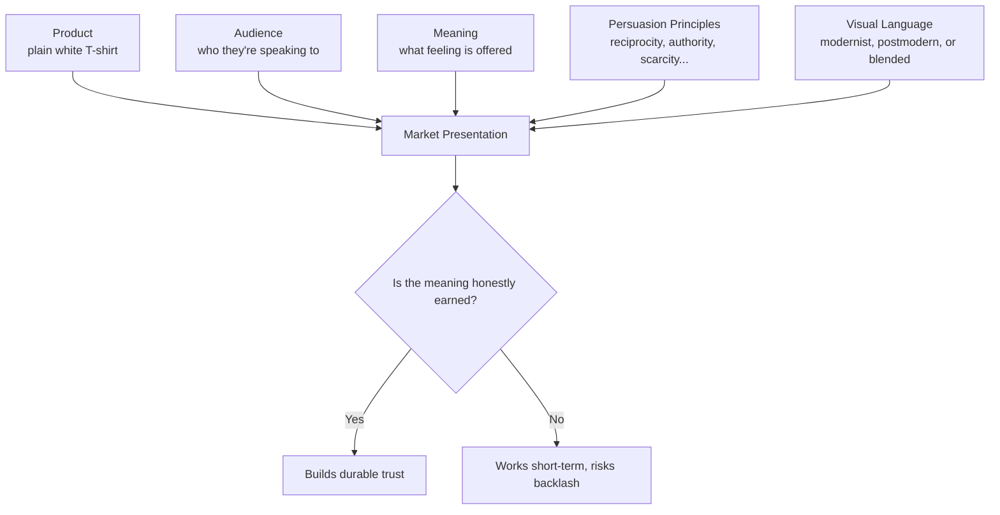

# Chapter 4 — The Plain White T-Shirt Case Study

## One Shirt, Five Companies, Zero Changes to the Stitching

By now the plain white T-shirt has followed you through three chapters like a very patient mascot. Time to give it the full treatment: one ordinary, genuinely well-made white tee, sold by five entirely different imaginary brands, each one convinced they're selling something completely different. They're not lying, exactly — they're just inviting the customer to buy a different *meaning* wrapped around the same 100% cotton.

This chapter is where persuasion (Chapter 1), archetype (Chapter 2), and visual language (Chapter 3) all get used at once, on purpose, so you can see how they stack.

## Concept 1 — "Basecamp Tee" (Explorer Archetype)

- **Target Audience:** People who hike, travel, or just like imagining they might, on any given weekend
- **Brand Archetype:** Explorer
- **Persuasion Principles:** Social proof ("the shirt 40,000 trail runners already trust" — framed as a real, verifiable number the brand would actually track), scarcity (limited seasonal dye batches), authority (details on breathable fabric testing)
- **Visual Language:** Rugged, outdoorsy photography; earthy accent colors against the white shirt; topographic-map textures in the background
- **Headline:** "Built for Wherever You End Up."
- **Short Product Story:** A shirt designed to disappear into the background of your next trip — light enough for a summit, plain enough to wear home from the airport without looking like a costume.
- **Likely Imagery:** A hiker mid-trail, shirt slightly wind-blown, dust on the boots, horizon in the background
- **Meaning Being Sold:** Readiness. The customer isn't buying fabric — they're buying the feeling that they're the kind of person who might leave, right now, if the opportunity showed up.
- **Ethical Risk / Limitation:** If the "trusted by trail runners" claim isn't actually true, this tips from Explorer-flavored persuasion into fabricated social proof — a real ethical line, not a stylistic one.

## Concept 2 — "The Standard" (Ruler Archetype, Restrained Swiss-Influenced Design)

- **Target Audience:** Design-conscious professionals who want to look put-together without looking like they tried
- **Brand Archetype:** Ruler
- **Persuasion Principles:** Authority (precise language about fabric weight and cut), framing (positioned as "the only white tee you need," reducing decision fatigue rather than offering more choice)
- **Visual Language:** Strict grid layout, generous white space, one sans-serif typeface, a single accent color used sparingly — a direct descendant of the Swiss / International Typographic Style from Chapter 3
- **Headline:** "One Shirt. Considered Completely."
- **Short Product Story:** No seasonal drops, no seventeen fits to choose from — just one white T-shirt, engineered once, correctly, and left alone.
- **Likely Imagery:** The shirt alone on a plain background, studio-lit, folded with exact, almost obsessive precision
- **Meaning Being Sold:** Quiet authority. The customer is buying the relief of a decision already made well by someone else — and the subtle status of looking like they didn't need seventeen options.
- **Ethical Risk / Limitation:** "The only shirt you need" is an opinion dressed as a fact. It can tip into false-scarcity-of-choice messaging if it implies competitors' products are inferior without evidence.

## Concept 3 — "RIOT WHITE" (Rebel Archetype, Disruptive Postmodern Design)

- **Target Audience:** Younger buyers who actively distrust polished, corporate-feeling marketing
- **Brand Archetype:** Rebel
- **Persuasion Principles:** Liking (irreverent, self-aware brand voice that feels like a peer, not a company), reciprocity (an intentionally blunt "we're not going to lie to you" tone that reads as a gift of honesty)
- **Visual Language:** Deliberately broken grid, clashing type sizes stacked at odd angles, harsh color blocking, an ironic tagline printed sideways across the product photo — straight out of the postmodern reaction described in Chapter 3
- **Headline:** "IT'S A WHITE SHIRT. WE'RE NOT GOING TO PRETEND OTHERWISE."
- **Short Product Story:** Built by people annoyed at how much marketing theater goes into selling a plain shirt — so they made the loudest, most honest-sounding un-marketing campaign they could.
- **Likely Imagery:** Grainy, candid-style photos, mismatched cropping, a model looking directly and unglamorously at the camera
- **Meaning Being Sold:** Anti-establishment identity. The customer is buying the feeling of seeing through marketing — while still, notably, buying into a very deliberate marketing strategy.
- **Ethical Risk / Limitation:** "Anti-marketing" marketing is still marketing. If the brand's irreverence is itself calculated to exploit distrust of ads, it risks a kind of manipulation-by-irony that's harder for the buyer to notice precisely because it looks like honesty.

## Concept 4 — "Little Cloud" (Innocent Archetype)

- **Target Audience:** New parents and gift-buyers looking for something simple and safe-feeling
- **Brand Archetype:** Innocent
- **Persuasion Principles:** Framing (emphasis on softness and simplicity rather than performance specs), liking (warm, gentle brand voice)
- **Visual Language:** Soft pastel accents around a mostly-white palette, rounded typography, lots of breathing room, gentle photography with natural light
- **Headline:** "Simple, Soft, and Nothing Else."
- **Short Product Story:** A shirt made with nothing to prove — no logos, no performance claims, just soft cotton and honest simplicity, the kind of basic you reach for without thinking twice.
- **Likely Imagery:** Folded shirt in warm natural light, minimal styling, maybe a single sprig of greenery beside it
- **Meaning Being Sold:** Comfort and ease. The customer is buying reassurance — that this purchase requires no research, no risk, and no second-guessing.
- **Ethical Risk / Limitation:** "Nothing else" framing can quietly discourage a buyer from comparing it against genuinely better or cheaper alternatives, by making comparison itself feel unnecessary.

## Concept 5 — "The Archive Piece" (Sage Archetype)

- **Target Audience:** Buyers who care about how things are made and want to feel informed about their purchases
- **Brand Archetype:** Sage
- **Persuasion Principles:** Authority (detailed, transparent information about sourcing and construction), commitment and consistency (an invitation to "join" an ongoing education about textiles, not just buy once)
- **Visual Language:** Editorial, almost textbook-like layout — diagrams of stitch types, small annotated callouts on the fabric, restrained typography with a slightly academic feel
- **Headline:** "Everything We Know About a White T-Shirt, Explained."
- **Short Product Story:** A shirt sold alongside its own explanation — how the cotton was woven, why this collar won't sag, what "combed cotton" actually means — treating the buyer as someone who wants to understand, not just purchase.
- **Likely Imagery:** Close-up macro shots of stitching and fabric weave, small diagrams, a slightly clinical but warm tone
- **Meaning Being Sold:** Understanding. The customer is buying the feeling of being a smart, informed shopper rather than an impulsive one.
- **Ethical Risk / Limitation:** Loading a page with technical-sounding detail can manufacture a false sense of expertise and trust (an authority-adjacent halo effect) even when the details, though true, aren't actually the most important factors in the shirt's quality.

## Synthesis Table

| Concept | Archetype | Core Persuasion Principle(s) | Visual Language | Meaning Sold | Main Ethical Risk |
|---|---|---|---|---|---|
| Basecamp Tee | Explorer | Social proof, scarcity | Rugged, outdoor photography | Readiness for adventure | Fabricated social proof numbers |
| The Standard | Ruler | Authority, framing | Restrained, Swiss-influenced grid | Quiet authority, decision relief | Implied superiority without evidence |
| RIOT WHITE | Rebel | Liking, reciprocity (via "honesty") | Disruptive, postmodern, broken grid | Anti-establishment identity | Irony used to mask calculated persuasion |
| Little Cloud | Innocent | Framing, liking | Soft, minimal, pastel-accented | Comfort, ease, safety | Discourages real comparison shopping |
| The Archive Piece | Sage | Authority, commitment/consistency | Editorial, diagram-like, academic | Being an informed shopper | False sense of expertise via detail overload |

## How It All Combines

Every version of this shirt runs through the same five inputs — product, audience, meaning, persuasion, visual language — and combines them into one market presentation. The shirt itself never moves through that diagram; only the story around it does.

## What You Should Remember

- The identical physical product can support radically different, entirely legitimate market positions, depending on which audience, archetype, persuasion principles, and visual language surround it.
- Explorer, Ruler, Rebel, Innocent, and Sage archetypes each invite the customer to buy a different feeling — adventure, authority, defiance, comfort, or understanding — not just a different shirt.
- Restrained, Swiss-influenced design and disruptive, postmodern design are both legitimate visual strategies; the right choice depends on the meaning being sold, not on which one is "better" design.
- Every persuasive strategy, no matter how appealing, carries a specific ethical risk worth naming explicitly — vague positivity about "good marketing" isn't enough; each technique needs its own honest audit.
- Product, audience, meaning, persuasion, and visual language aren't separate skills — real brand work combines all five into a single coherent presentation, and the shirt is simply the constant that lets you see the variables clearly.
