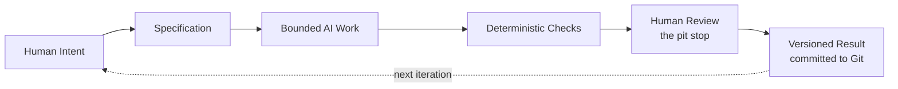

# Chapter 5 — Building the Mini Textbook: Directing AI With Intent

## Three Lenses, One Framework

Across the last four chapters you picked up three separate lenses: persuasion, archetype, and design language. Individually, each one answers a different question about a piece of work. Together, they form something more useful than the sum of their parts: a high-level control framework you can use to direct creative and technical work — including work you hand off to an AI system.

Here's the conceptual model, stated plainly:

- **Persuasion** helps answer: *what response are we trying to enable in the person on the other end?*
- **Archetype** helps answer: *what meaning or identity are we expressing?*
- **Design language** helps answer: *how should that meaning actually look and feel?*

Notice the order. Persuasion sets the goal, archetype sets the story, design language sets the surface. Skip straight to design language ("make it look cool") without the first two, and you get something visually competent but directionless — technically fine, meaningfully empty. This chapter is about using all three lenses deliberately, especially when an AI is doing part of the execution.

## From Creative Framework to AI Control Framework

Directing an AI assistant is not fundamentally different from directing a design decision — you're still answering "what response, what meaning, what feel?" The difference is that an AI can generate a huge volume of plausible-looking output very quickly, which means vague direction produces vague (or subtly wrong) results at scale. The three lenses give you a compact way to specify intent before generation happens, instead of discovering your actual intent by reacting to what the AI produced.

But intent alone isn't enough to safely direct AI-generated work. You also need a process around it. That process has four parts.

### 1. Specification — Bounding the Work

An AI task should be scoped by a clear specification: what's being built, what "done" looks like, and — just as important — what's explicitly out of scope. An unbounded prompt ("build me a good landing page") invites the AI to make dozens of silent decisions on your behalf, using its own defaults instead of your judgment. A bounded specification turns those decisions back over to you, before the work starts, when they're cheap to make.

### 2. Version Control — Traceability and Recovery

This is where Git enters the picture. When an AI generates a large volume of a codebase or document, you need a reliable way to see exactly what changed, when, and why — and a way to undo it if it's wrong. Git gives you:

- **Traceability** — every change is attributed and timestamped, so you can always answer "what did the AI actually touch?"
- **Recovery** — a bad generation is never a catastrophe. You can revert to the last known-good commit instead of hand-repairing damage.
- **Review surface** — a diff is a much better review tool than re-reading an entire file, because it shows you exactly what changed rather than making you spot the change yourself.

Version control isn't a nice-to-have when AI is involved — it's the safety net that makes fast, bounded AI iteration survivable.

### 3. Deterministic Checks — Cheap, Repeatable Validation

Before any human looks at AI-generated work, run whatever deterministic checks exist: does the code compile, do the tests pass, does the linter complain, is the required file actually present, does the Mermaid diagram parse. These checks are called deterministic because the same input always produces the same result — no judgment involved, no ambiguity, just a pass or fail. They're cheap to run repeatedly and they catch a huge share of mechanical problems before a human ever needs to spend attention on them.

### 4. Probabilistic Review — Useful, but Not Certain

An AI reviewing another AI's output (or even reviewing its own) can catch real problems — inconsistent tone, logical gaps, missed requirements. But that review is *probabilistic*, not deterministic: it's an educated guess based on patterns, not a guarantee. It might miss something real, or flag something that isn't actually a problem. Probabilistic review is a useful extra layer, not a substitute for the next step.

### 5. Human Judgment — Where Responsibility Actually Lives

Deterministic checks catch mechanical failures. Probabilistic review catches likely patterns. Neither can tell you whether something is *true*, whether it's *appropriate for this audience*, whether it *quietly crosses an ethical line*, or whether it actually satisfies the *intent* behind the specification rather than just its literal wording. That's human territory, and it stays human territory no matter how good the automation gets. Meaning, truthfulness, context, and final responsibility for the outcome don't transfer to a tool just because the tool did the typing.

## The Pit-Stop Metaphor

Think of this whole pipeline like a race car during a race. Most of the time, the car is running on its own — the driver drives, the systems monitor themselves, the process doesn't stop every ten seconds to double-check itself. That's the automation layer: bounded AI generation plus deterministic checks, running continuously without needing a human standing over every step.

But at specific, deliberately chosen moments, the car pulls into the pit for a real human inspection — tires, fuel, brakes, checked by a person, not a sensor. The race doesn't stop entirely, and the crew doesn't inspect every single lap. They inspect at the moments that matter, thoroughly, and then send the car back out.

That's what human review should look like in AI-assisted work: not a bottleneck applied to every keystroke, and not an afterthought applied never — but a deliberate, well-timed checkpoint where a person actually looks closely, at the moments where being wrong would actually cost something.

## The Complete Workflow

Notice this loops. A versioned result becomes the new baseline for the next round of human intent — the workflow isn't a one-shot pipeline, it's a cycle you run repeatedly, each time with a slightly more specific specification because you learned something from the last round.

## Bringing the Three Lenses Back In

Here's how the whole book connects. Before you write a specification for an AI task, you can run it through the same three questions from Chapters 1–3:

- **Persuasion:** What response am I actually trying to enable in whoever encounters this output?
- **Archetype:** What meaning or identity should this output express?
- **Design language:** How should that meaning look and feel, concretely?

Answer those three questions first, and your specification becomes sharp instead of vague. The AI isn't guessing at your intent anymore — you've already done the thinking that intent requires, and the AI's job shrinks down to what it's actually good at: fast, bounded execution inside boundaries you set.

## Questions for Next Week

- Pick something you've asked an AI to generate recently. Could you have answered the persuasion, archetype, and design-language questions *before* prompting it, instead of after?
- Where in your own workflow is there no "pit stop" at all — no deliberate human review point? What would it cost to add one?
- What's one deterministic check you could add to a project you're working on that would catch a mistake before a human ever has to notice it manually?
- If an AI-generated piece of work turned out to be wrong or misleading, who is actually responsible for that — and does your current workflow reflect that answer?

## What You Should Remember

- Persuasion, archetype, and design language form a compact framework: what response, what meaning, what feel — and that framework applies to directing AI just as much as it applies to a poster or a product.
- Bounded specifications turn silent AI assumptions back into deliberate human decisions, made before generation instead of discovered after.
- Git provides traceability and recovery, turning AI iteration from a risky gamble into a safe, reversible loop.
- Deterministic checks are cheap and repeatable; probabilistic AI review is useful but never certain — neither replaces human judgment.
- Humans remain responsible for meaning, truthfulness, context, and final decisions — no amount of automation transfers that responsibility away.
- The pit-stop metaphor: automation runs continuously, but deliberate, well-timed human inspection is where quality and trust actually get protected.
